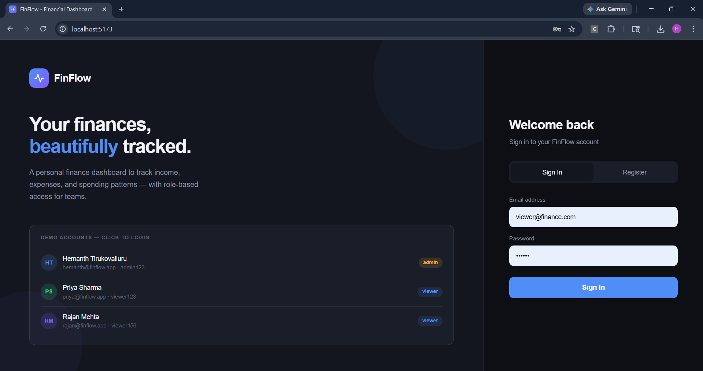
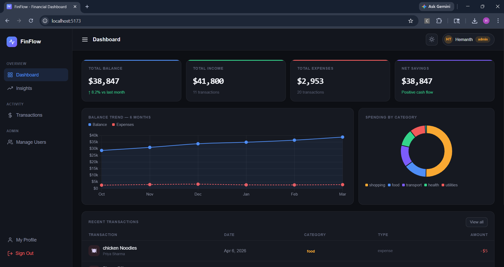
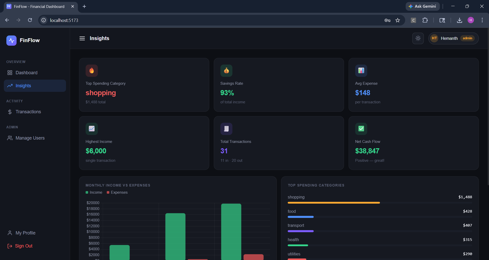

# FinFlow — React Finance Dashboard

A full-featured, role-based finance dashboard built with React.

---

## Quick Start

```bash
npm install
npm start
```

Open [http://localhost:3000](http://localhost:3000)

---

## Demo Accounts

| Name | Email | Password | Role |
|------|-------|----------|------|
| Hemanth Tirukovalluru | hemanth@finflow.app | admin123 | Admin |
| Priya Sharma | priya@finflow.app | viewer123 | Viewer |
| Rajan Mehta | rajan@finflow.app | viewer456 | Viewer |

Or register a new account on the login page.

---

## Features

### Authentication
- **Login / Register** on a split-panel landing page
- Demo user quick-login cards
- Passwords stored in `db.json`, sessions persist to `localStorage`

### Role-Based UI (RBAC)
- **Viewer**: sees only their own transactions and data; read-only mode
- **Admin**: sees ALL users' data, can add/delete transactions for any user, can manage users

### Pages

| Page | Viewer | Admin |
|------|--------|-------|
| Dashboard | Own data, charts | All users' data |
| Transactions | Own txns, search/filter/sort, export CSV | All txns + add form with user selector + delete |
| Insights | Own insights, charts, monthly summary | Aggregated insights across all users |
| My Profile | Personal details, own transactions | Same + admin badge |
| Manage Users | ❌ Hidden | Full user list, expand to see transactions, delete users |

### Data Architecture
- `src/db.json` — source of truth (users + transactions)
- `src/context/AppContext.jsx` — `useReducer`-based global state
- Mutations persisted to `localStorage` under `finflow_db`
- Session stored as `finflow_user`

### Optional Enhancements
- ✅ Dark / Light mode toggle
- ✅ localStorage persistence
- ✅ CSV export (all pages)
- ✅ Animations (page fade-in, progress bars)
- ✅ Registration flow

---

## Screenshots

### Login Page


### Dashboard Overview


### Transactions Page


### Insights Page


---

## Project Structure

```
src/
├── context/
│   └── AppContext.jsx     # Global state (useReducer + localStorage)
├── pages/
│   ├── AuthPage.jsx       # Login + Register
│   ├── DashboardLayout.jsx# Sidebar + topbar + routing
│   ├── DashboardPage.jsx  # Summary cards + charts
│   ├── TransactionsPage.jsx
│   ├── InsightsPage.jsx
│   ├── ProfilePage.jsx
│   └── UsersPage.jsx      # Admin only
├── db.json               # Mock database (users + transactions)
├── utils.js              # Shared helpers
├── App.jsx
├── index.js
└── index.css
```

---

## Tech Stack

- **React 18** (Create React App)
- **Chart.js 4 + react-chartjs-2** for charts
- **CSS custom properties** for theming (dark/light)
- **Google Fonts** — DM Sans + DM Mono
- No backend — all data in `localStorage`
